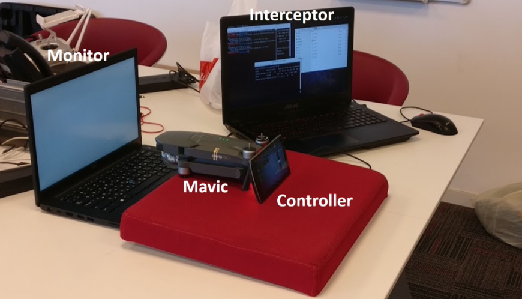
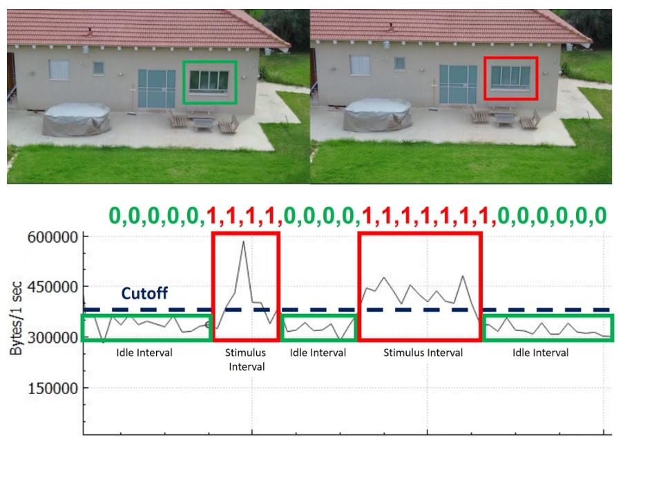
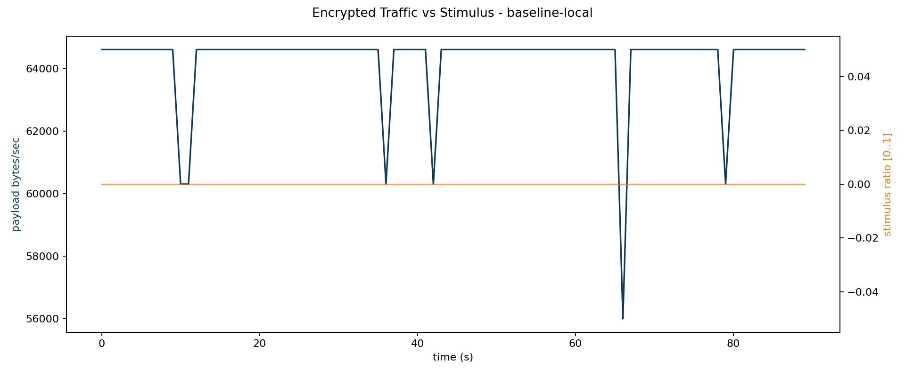

# Game of Drones Encrypted Stream Side Channel Lab

This repository contains a local, containerized experiment that demonstrates a key idea from the Game of Drones paper: even when transport is encrypted, traffic metadata can still reflect visual scene changes.

The lab runs entirely on one machine using Docker Compose.



## Quick Start

Run the experiment with these commands:

```bash
./scripts/host/generate_certs.sh
./scripts/run/run_experiment.sh baseline
./scripts/validate/check_outputs.sh
```

For other experiment profiles:

```bash
./scripts/run/run_experiment.sh area_sweep
./scripts/run/run_experiment.sh fragmentation_sweep
./scripts/run/run_experiment.sh brightness_sweep
./scripts/run/run_experiment.sh watermark_pattern
```


## What This Lab Demonstrates

1. Synthetic scene changes are generated in a controlled way.
2. Frames are transported over a TLS encrypted channel.
3. Payload bytes per time window are analyzed.
4. Stimulus timing is compared with encrypted traffic variation.

In short, it lets you test whether visual changes remain detectable from encrypted flow shape.



## Important Note About This Implementation

This implementation is intentionally simple and reproducible:

1. It currently sends JPEG frames over a custom TLS socket protocol.
2. It does not yet implement RTP/SRTP or ffmpeg H.264 pipeline.
3. The experiment still captures the side channel principle (stimulus -> size variation -> encrypted traffic signal).

## Architecture

Services:

1. `video-generator`: Creates synthetic frames and logs ground truth stimulus metadata.
2. `stream-sender`: Reads frames and sends them to receiver over TLS.
3. `stream-receiver`: Accepts TLS stream and stores received frames.
4. `analyzer`: Correlates sender bytes with stimulus labels and generates reports.

Logical flow:

`video-generator -> stream-sender -> TLS/TCP -> stream-receiver`

Artifacts + analysis:

`data/generated + data/logs -> analyzer -> data/metrics + data/reports`

## Repository Structure

Key directories:

- [compose](compose)
- [docker](docker)
- [src](src)
- [configs](configs)
- [scripts](scripts)
- [data](data)
- [docs](docs)

Main files:

- [compose/docker-compose.yml](compose/docker-compose.yml)
- [compose/.env](compose/.env)
- [scripts/run/run_experiment.sh](scripts/run/run_experiment.sh)
- [scripts/host/generate_certs.sh](scripts/host/generate_certs.sh)
- [scripts/validate/check_outputs.sh](scripts/validate/check_outputs.sh)
- [docs/runbook.md](docs/runbook.md)

## Prerequisites

Install on host:

1. Docker Desktop (or Docker Engine + Compose plugin)
2. OpenSSL CLI
3. Optional: tcpdump / tshark for packet capture

Confirm Docker is running:

```bash
docker version
docker compose version
```

## Quick Start

### 1) Generate TLS certs

```bash
./scripts/host/generate_certs.sh
```

Generates:

- [configs/tls/certs/server.crt](configs/tls/certs/server.crt)
- [configs/tls/certs/server.key](configs/tls/certs/server.key)

### 2) Run baseline experiment

```bash
./scripts/run/run_experiment.sh baseline
```

What the script does:

1. Validates experiment config exists.
2. Ensures certs are present.
3. Starts generator, receiver, sender in detached mode.
4. Waits until completion markers are produced.
5. Stops pipeline services.
6. Runs analyzer.
7. Tears down network and containers.

### 3) Validate outputs

```bash
./scripts/validate/check_outputs.sh
```

Expected success files:

- [data/generated/frame_metadata.csv](data/generated/frame_metadata.csv)
- [data/logs/sender_log.csv](data/logs/sender_log.csv)
- [data/logs/receiver_log.csv](data/logs/receiver_log.csv)
- [data/metrics/traffic_timeseries.csv](data/metrics/traffic_timeseries.csv)
- [data/reports/final_report.md](data/reports/final_report.md)
- [data/reports/stimulus_overlay.png](data/reports/stimulus_overlay.png)

## Running Other Experiments

Use one of the config names below:

```bash
./scripts/run/run_experiment.sh area_sweep
./scripts/run/run_experiment.sh fragmentation_sweep
./scripts/run/run_experiment.sh brightness_sweep
./scripts/run/run_experiment.sh watermark_pattern
```

Config files are located in [configs/experiments](configs/experiments).

## Experiment Set (Current)

### baseline

Config: [configs/experiments/baseline.yaml](configs/experiments/baseline.yaml)

- No active visual stimulus.
- Used as control profile.

### area_sweep

Config: [configs/experiments/area_sweep.yaml](configs/experiments/area_sweep.yaml)

- Stimulus area increases over time (within configured window).
- Useful to test sensitivity of bytes/sec to changed pixel proportion.

### fragmentation_sweep

Config: [configs/experiments/fragmentation_sweep.yaml](configs/experiments/fragmentation_sweep.yaml)

- Keeps area roughly fixed while increasing number of regions.
- Useful to evaluate effect of dispersed changes.

### brightness_sweep

Config: [configs/experiments/brightness_sweep.yaml](configs/experiments/brightness_sweep.yaml)

- Keeps area and region count, ramps brightness.
- Useful to observe how contrast affects encoded frame size.

### watermark_pattern

Config: [configs/experiments/watermark_pattern.yaml](configs/experiments/watermark_pattern.yaml)

- Uses a known binary pattern and time windows.
- Lets you test recoverability from encrypted traffic shape.

## Configuration

### Environment defaults

Set in [compose/.env](compose/.env):

- `EXPERIMENT_ID`
- `EXPERIMENT_CONFIG`
- `WIDTH`, `HEIGHT`, `FPS`
- `TRIAL_DURATION`
- `JPEG_QUALITY`
- `RECEIVER_HOST`, `RECEIVER_PORT`
- `TLS_CERT_PATH`, `TLS_KEY_PATH`

### Experiment YAML schema

Each file in [configs/experiments](configs/experiments) includes:

1. `identity`
2. `video`
3. `stimulus`
4. `transport`
5. `analysis`

Most important `stimulus` fields:

- `type`
- `start_time`, `stop_time`
- `window_ms`
- `binary_pattern`
- `changed_area_percent`
- `region_count`
- `brightness_level`

## Data Outputs and Meaning

### Generated data

- [data/generated/frames](data/generated/frames): JPEG frames produced by generator.
- [data/generated/frame_metadata.csv](data/generated/frame_metadata.csv): frame level ground truth.

Key metadata columns:

- `frame_index`
- `relative_time_s`
- `stimulus_on`
- `bit_value`
- `changed_area_percent`
- `region_count`
- `brightness_level`
- `payload_bytes`

### Transport logs

- [data/logs/sender_log.csv](data/logs/sender_log.csv): sender side payload bytes by frame.
- [data/logs/receiver_log.csv](data/logs/receiver_log.csv): receiver side message receipt.

### Analysis artifacts

- [data/metrics/traffic_timeseries.csv](data/metrics/traffic_timeseries.csv): bytes/sec and stimulus ratio per second.
- [data/reports/stimulus_overlay.png](data/reports/stimulus_overlay.png): overlay plot of encrypted traffic vs stimulus.
- [data/reports/final_report.md](data/reports/final_report.md): summary stats and correlation.

Example analysis image:



## Optional Host Packet Capture

You can capture host traffic during a run:

```bash
sudo tcpdump -i any -w data/pcaps/exp_capture.pcap tcp port 8443
```

Then run an experiment in another terminal and stop capture when finished.

## Operational Details

### Completion markers

The run script waits for:

- [data/generated/sender.done](data/generated/sender.done)
- [data/received/receiver.done](data/received/receiver.done)

This avoids premature shutdown while data is still in transit.

### Timeout control

Default run timeout is 600s. Override for long experiments:

```bash
RUN_TIMEOUT_SECONDS=1200 ./scripts/run/run_experiment.sh watermark_pattern
```

## Troubleshooting

### `docker compose` command not found

Install Docker Compose plugin or Docker Desktop and verify:

```bash
docker compose version
```

### Receiver fails with cert errors

Regenerate certs:

```bash
rm -f configs/tls/certs/server.crt configs/tls/certs/server.key
./scripts/host/generate_certs.sh
```

### Pipeline times out

1. Check service logs:

```bash
docker compose -f compose/docker-compose.yml --env-file compose/.env logs --tail=200 video-generator stream-sender stream-receiver
```

2. Increase timeout with `RUN_TIMEOUT_SECONDS`.
3. Ensure Docker has enough CPU and memory.

### Output files missing

Run validator:

```bash
./scripts/validate/check_outputs.sh
```

If missing, rerun experiment and inspect logs.

## Reproducibility Tips

1. Keep one run per experiment config and archive outputs with timestamped folders.
2. Do not edit code between comparative runs.
3. Keep host load stable to reduce timing noise.
4. Use same machine and Docker resource limits across trials.

## Security and Ethics

This project is for controlled, authorized experimentation on your own system.
Do not use it for unauthorized interception or privacy-invasive activity.


## Paper Reference

Title:
Game of Drones Detecting Streamed POI from Encrypted FPV Channel

Video:
https://www.youtube.com/watch?v=4icQwducz68

Authors:

1. Ben Nassi
2. Raz Ben-Netanel
3. Adi Shamir
4. Yuval Elovici

Paper Link: https://arxiv.org/pdf/1801.03074